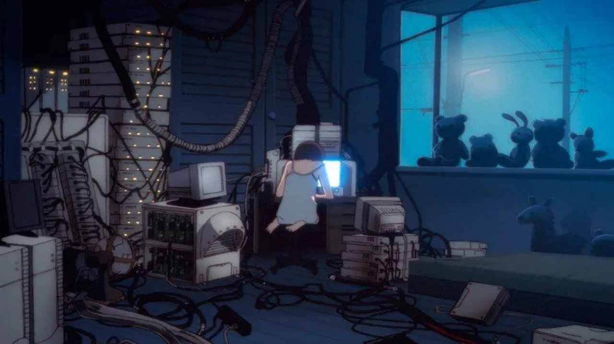

Accompany me on this descent into madness!



# A Bit of Background

Games have always been an important part of my life, I spend a good chuck of my professional and personal life playing and developing them, they were the reason I got into programming
in the first place, but more than single-player games, my love has always been for online games, while most people's first interaction with online games comes from games like World of Warcraft (WoW),
shooter games or your generic games on Facebook, my journey started with Dofus, a French game that is really popular in Latin America as well.^[The reason for this is due to economics, while
most people saw WoW and wanted to play it, access to the internet, a decent computer and even more being able to pay a game and a game sub was a privilege in Latin America and still is to this day.
While Dofus had a subscription as well, it was the first online (to my knowledge) to accommodate to the Latin America landscape, cheap subscription that you could get as easily as
getting some credit in your phone and sending a paid message to get a sub for a couple of days, for you as a kid that was the dream, no credit cards, no bank transfers just your phone]

The idea of connecting with other players, having guilds, having a virtual economy was fascinating for me even at a young age where those "concepts" weren't even clear at the time. My
initial interaction with programming was so called "hacks" for Dofus, you took cheat engine and tried to set your kamas^[Dofus digital currency] to millions and brag to your friends,
but as I learnt, having a client representation of it does not mean I actually had that on the server and that fueled my curiosity and got me into learning how online games work,
network protocols, game servers, databases and more. It became my full time home at the time.

Going a couple years ahead during my graduation from High School paradoxically I wanted to learn Graphic Design, it was a short-lived dream that made me realize that I enjoyed more programming
than designing^[I still love everything related to design, art and such but I approach it more as an appreciation than as a practitioner]. So I turned my hobby into my job, but the
passion for games and game servers always had been there and it's been fueled more with my time spent on real-time and distributed systems.

# Game Server and Game Engines

Because of that passion for online games we are here at this post and what will result from here on out.

Over the last couple years my perspective as a programmer has changed a lot thanks to
learning new things, the work I've done and the learnings from industry experts such as Chris Lattner, Simon Peyton Jones, Edward A Lee, Casey Muratori and Andrew Kelly^[I'll stop there because
the list might get big] I came to the epiphany that we can do more as programmers to improve things and not sit on the "if it works is good enough".

This led me to bite the bullet and try
to implement my own game engine from scratch, as a learning, research and personal growth project^[Over my career I always ignored all the you "you should not do this alone", is too hard to
do alone and the why reinvent the wheel, I think it's extremely fundamental for us to challenge that, create new things and that's how advancements and improvements happens in the field]

## Game servers

Over these current and future conversations when I talk about game servers I'll be talking to a specific category of game servers called authoritative game servers, I won't be going
into the weeds explaining the different kinds of game servers and how they work because other people have done a much better job at explaining the what, why and hows much better than
I'll ever do^[When it comes to online games one of the "bibles" for information regarding it is [gafferongames](https://gafferongames.com/) if you're interested on the fundamentals
and even advanced techniques, also on types of game servers, please check [this article by the same author](https://mas-bandwidth.com/choosing-the-right-network-model-for-your-multiplayer-game)].

But the basic idea of authoritative game servers (AGS) is that the server is in control of everything and the client is just displaying the view of what the server has and on a well
implemented server, ideally a game server has zero trust of any message sent by the client so it always performs checks (As you always should, please always validate your data).

AGSs as any other architecture has its benefits and drawbacks^[check previous side note for more information] but I'll focus on the pros of this architecture:

- **Determinism**^[A deterministic model as Edward A. Lee describes on its book 'Deterministic Concurrency' - "A model is deterministic if given all the inputs that are provided to
the model, the model defines exactly one possible behavior."]: This is not a feature of all AGSs but an invaluable one that we'll discuss latter on, for the moment just think of this as
a plus for debugging, reproducibility, bug fixing and more
- **Security**: As long you validate the data correctly the server is the only source of truth, that gives you an edge on security because Client modifications can't lead to exploits,
bugs and such^[This has its limits of course, for example a shooter game is really hard to know if it's a pro or an AI sending the inputs, as server you can validate correctness but a
well developed Bot can replicate that correctness and a lot of times it looks like a really good player than a Bot]
- **Observability and metrics**: All data passes through your server, you can do analytics, optimize based on patterns and more

AGSs are mostly used for large MMO games, games where there are large shared worlds where we want to make sure all players have the "same view of the world", because of this these
servers tend to be massive dedicated servers with either distributed nodes or massive monolithic servers with big hardware requirements^[Black Desert Online is one of those,
a couple years ago a VM for the official server was leaked and the minimum specs for the Java server were (if my memory serves me correctly) 160GB of ram, more than 64 cores and such and that's for a single region],
and lately those servers have begun to communicate between each other, like in the case of cross region play on FF14, and becoming massive distributed systems.

That does not mean you can't use AGSs for non MMO games, is quite possible but it adds a this server layer to maintain and while there are services for that they tend to be way more expensive
than operating them yourself.

But more than that creating an authoritative server is not easy task, specially for a programmer that is familiar with a client only workflow, often times you have to replicate
logic between the client and server (even more when the server is in another language than the client), learn about backend development, sharding, networking, databases, replication
and more.

My purpose is to lower that ceiling when it comes to creating AGSs, simplify the process and makes things easier creating a game engine that takes into account
all these challenges and tries to streamline into the engine to make it extremely simple for servers to deploy

And current game engines have been working on this for years, Unity NGO and related, Unreal Engine Iris and related, trying to unify these concepts and making online worlds
easier to implement and maintain.

But if you have worked with them you can see they are far from perfect and most of the time games end up creating separate architectures that the only
shared information is the network protocol and things are implemented differently, often times replicating logic and such or just fall back on other types of online game architectures
that are easier to maintain but introducing a lot of issues and this is one of the main reason why kernel anticheat exists, it allows you to somehow trust the client and avoid a lot of
mental and work overhead as opposed of authoritative game servers

> That begs the question, do we need a custom game engine? And the answer is no, we should be able to implement this on an existing engine, in fact most things used for AGSs can be
(and pretty much are) implemented on existing engines.

So why create a new engine? And the answer is simple, current game engines are general engines, meaning that they try their best to accommodate to as many games as possible, that includes
online, not, and anything in between, with support of widely different platforms and architectures, that comes at the cost of network and online code being a second class feature
rather than a first class one and it shows because while you use in game engine features they don't map completely for what you want as a backend engineer and focuses more on the
client developer than the server one, that's why I want to explore this from the most fundamental part of a game which is a game engine.

## Game Engines

I consider OS, Databases and Game Engines the holy grail of computer science and software engineering, in fact Databases and Game Engines these days behave more like micro OSes than software
that runs on top of it, in the case of Databases they have to squeeze as much performance as possible from the OS and Hardware and game engines even more because they have to take all IO
(input, audio, sockets, etc...), all memory related, CPU for logic and processing and on top of that GPUs for rendering data while fighting for resources from the common OS tasks.

Because of the immense complexity of building a game engine, the common thing you hear when trying to build a game engine is **Build a game not a game engine** and that's completely true
and I recommend that to anyone trying to create its first engine, it sets the limits and eventually you'll have a framework (or game engine) for your game.

But we came here with a purpose in mind and that's online games focus, because of that we have to already have a fundamental architecture, and general idea of how things need to
work and somehow how to accommodate all together to make online games simple to make. And I want to take the approach of going as low level as possible to have as much control
of the whole pipeline and the decisions and architecture to accommodate to higher level features, abstractions and implementations

# So... What makes a Game Servers and a Game Engines so different?

I would say that at its core they are not that different and the rendering engine and everything that has a visual input separates the two, in AGSs you want the server to be the "central visual
representation" of all state and the game engine is in charge of rendering that server representation with all the things in between like animations, sound effects, music,
particles and so on, but at its core most logic and components are shared^[Experts might disagree with me but I'll try to explain what I mean during this series].

:::{.column-page}
```{mermaid}
flowchart LR
    subgraph Client ["Game Client (Engine Only)"]
        direction TB
        I(Input Manager)
        R(Rendering Engine)
        A(Audio System)
        UI(User Interface)
    end

    subgraph Shared ["Overlap (Engine & Server)"]
        direction TB
        GL(Game Logic & Scripting)
        P(Physics & Collision)
        SM(Entity & State Management)
        N(Networking / Netcode)
    end

    subgraph Server ["Game Server (Dedicated)"]
        direction TB
        SA(Server Authority / Validation)
        MM(Auth, permissions, region distribution, etc...)
        DB[(Database / Persistence)]
    end

    %% Internal Client Flow
    I -->|Player Action| GL
    SM -->|Draws| R
    SM -->|Plays| A
    SM -->|Updates| UI

    %% Overlap Interaction
    GL <-->|Calculates| P
    P <-->|Updates| SM
    GL <-->|Syncs| N

    %% Server Interaction
    N <-->|Packets| SA
    SA <-->|Queries| DB
    SA <-->|Checks| MM

    classDef client fill:#d4e6f1,stroke:#2980b9,stroke-width:2px,color:#000;
    classDef shared fill:#d5f5e3,stroke:#27ae60,stroke-width:2px,color:#000;
    classDef server fill:#fadbd8,stroke:#c0392b,stroke-width:2px,color:#000;

    class Client client;
    class Shared shared;
    class Server server;
```
*An overly simplified example^[It's lacking assets management and way more things in both client and server], if you want a better example for a game engine architecture diagram please check [C4 Engine](https://c4engine.com/)*
:::

As you can see in this simplified example, the client and server shares a big chunk of things, the difference is the scale and processing of it, clients normally process the info they have
and perform the logic (in the case of client side prediction and related) or just render the server state and most of the logic is at the server.

The keen eye might have noticed that we have a "Server Authority / Validation" on server are similar in a sense to Game Logic in the shared components and to you I'll say
that you're on the right track of what this post is about. But in any case I need to make distinctions:

- **Server Authority** can mean game logic, but it also looks game logic in a bigger scale, you are looking at possible all players and all those players, permissions they have and things
that work at a larger scale, so an AoE attack does damage to multiple targets in client logic, but at a server scale it also does it but it has to take into account plethora of rules and
permissions, the client can also do it and avoid sending the event to the server if invalid but here you can see that it can overlap and that's one of the core principles we can exploits
for the game engine architecture and we'll discuss later.

- **Validation** goes in hand in hand with data validation, basically is the server say of checking "I don't trust this client is an actual player, let me check all the data sent by it is
logically valid with the rules I've" and achieves a sense of determinism, rules and security control, which the client can have this sense of determinism and is the fundament of client
prediction and rollback in a way.

Because of this shared components one can say that having a shared way of having both game and server developers sharing implementations while having the tools to do optimizations
on each area is not completely crazy and game engines have been trying that as I mentioned before, but there's a huge distinction for what a logic or data processing on the server
looks on the client, on the client you mostly work on gameplay and on "entity" logic, but for servers you manage that but at a larger scale, with data sync, databases, locks, mutexes,
replication, multiregion communication, load balancers and much more

But if we looks at things at its very core the validation side of things that the server needs to do is clearly imposed by the client developer^[I'll start calling client developers
to the Game engine side, the ones that do gameplay, game logic etc...]
they decide when something works or not, the interaction between entities, the game rules and such in a sense they are telling the server the validations and they need to the through
with it or bugs and weird behaviour starts to occur, but at the same time they are not thinking about multicore data processing, distributed systems and such which are an essential part
of game servers.

## But what if the client and the server developers don't have to think about distributed systems at all?

What if the client is in charge of all the logic and things just magically work without the server developer even needing to think about the hard things in distributed systems?^[By this point we are treating Game Servers as what they are, really complex and
sophisticated distributed systems] or at least let the client developer making it clear for the server developer have an easier job

**THAT'S THE GOAL**, that's the reason of this post and my plans to make that possible, because of that we need to start doing a couple things:

- Try to unify game engine and servers as much as possible
- Treat both as distributed systems, even if the client is a single machine, we still treat it in the same way because of multicore and parallel processing
- Games are about fast prototyping and we want to keep that, or at least make it as close as possible to do so^[Rapid prototyping and distributed systems don't get along and we'll explore that in the future]
- All of that while using hardware to its maximum whenever possible

# Implementing a Game Engine from scratch

Given our goals it's time to implement our game engine! Or is it?

Well the reality is that we can't go anywhere without a clear view of the architecture we want to implement and how to accomplish it

Given our requirements we need to have something that is deterministic, so when something goes wrong we can easily debug and that's one of the properties for having an easier time
implementing our distributed system, is the core and were all starts to take form^[I'll explore more on determinism on a later post, but for the moment you have to take my word on
that it's what we want and is a hard requirement]

But normally determinism breaks apart when we go into parallel execution which is something we have to do in order to make use of all cores in our client and server,
by default any scheduling system for parallelism does not take into account ordering of tasks, making it not possible to have determinism, but we can try enforcing
it having a robust data architecture for the engine, that's why ECS is so popular lately because it lets you create directed acyclic graphs that map into our Deterministic Scheduler
^[We'll explore in a later post why I don't choose to use ECS as the main data architecture]

On top of that most implementations of parallel execution in modern languages like async in Rust use work-stealing to achieve it, but in doing so destroys cache locality
^[There's [this](https://pmbanugo.me/blog/why-async-await-complect-concurrency) really interesting post that I found my research and does an stellar work of explaining the issues described]
and we want to avoid those scenarios

Well lately with Languages like Rust, Mojo, Swift and others came to realization that we can make the compiler enforce complicated rules like that and provide language constructs to
achieve complex things like memory safety, fearless concurrency and more while having top performance

### So let's use those languages to implement that!

Well not so fast, as everything in engineering we need to use the right tools for the job and for that we still need an informed look of our requirements

So my purpose is to create a Game Engine from absolute scratch with minimal dependencies, but this "from scratch" has its limitations:

- You still need to interface with the OS for IO, Windowing APIs and such
- You still need to interface with a Graphics API^[We are going full Vulkan for this project btw]

So at that point you absolutely need interfacing with C or C++ via FFI, while most languages have interfacing with all OS related tools by default, you need to interface with
the Graphics API and that requires FFI like it or not, as far as I know there are no alternatives and while you have Cuda and such you can't "render with it"

That leaves us with the requirements of:

- Good C or C++ interoperability
- high performance computing capabilities like SIMD, compiled language etc...
- good support/constructs for safe parallel programming
- memory safe, because that's what the cool kids do today! **But in a serious note, this is extremely important for distributed systems, the less surface for error and undefined
behaviours the easier it is, not using a memory safe language or patterns puts us in a terrible disadvantage**

> I need to mention that I chose to do a fully bindless rendered for the game engine, this is because rendering is inherently non-deterministic and handling all of it in the GPU
while maintaining the CPU side deterministic simplifies things a ton and let us focus on the distributed side of things while treating rendering like an external call with minimal
maintenance in the grand schema of things

With this we have a clear view of requirements and we can start evaluating our languages!

> There are ways to achieve memory safety on non memory safe languages, like double buffering, ECS and strict engineering practices, also focus on determinism help us but one of the
things about distributed systems and rapid prototyping is that these safe measures collide easily given distributed system requirements

#### C and C++
While using C is the simpler option, since it's fast, reliable, you can use other C and C++ code easily and there's a familiarity in the game engine dev community, but it lacks our
requirements on parallel and memory safety, you can achieve determinism but scales poorly as mentioned

C++ is the  evolution, you can train yourself to write really good C++ code and not end up making a template mess with good practices but same issues as C

#### Zig and Odin the safer C alternatives

Zig and Odin are not memory safe, but they provide the tools to do so, so it's safe by architecture but not by enforcement and proof like Rust and such, Odin specially has a special focus on
game development and a lot of tools for that, but both Zig and Odin fail at data parallelism and constructs for distributed systems^[I'm sure some people might disagree, at the
end of the day you need only to create Threads and manage them to achieve parallelism, but when we add safety, determinism and distributed systems requirements those tools fall short,
even then you can achieve close things like [this](https://github.com/pmbanugo/tina) but it's not enough and we explore the why on a later post]

#### Rust

The new cool kid, I actually like Rust and evangelized it a lot, but we need to take a pretty pragmatic look at it to see if it works for us or not.

While rust have integrations for C and C++ they are not the easiest and you end up having to do a lot of work to make the type system happy avoiding the oh so scary unsafe ^[Can we please
stop the anti-unsafe sentiment so many people have? it's a requirement for interfacing with OS and related and isn't as bad as people make it to be]
it's annoying but manageable, and while there's a lot of libraries and such when you work with bleeding edge capabilities in Vulkan existing libraries don't have answers yet for new features
so either you implement a wrapper yourself or open PRs for changes and wait for review and such that can slow down development (we want minimal dependencies remember that)

One of Rust's main strengths is it's "Fearless Concurrency" but I think is a bad word, it's not fearless, you can still have Deadlocks, logical race conditions and more often than not
you end up fighting the compiler to prove things, but despite that the tools are way more robust thanks to the borrow checker and all the data race free guarantees. But then you have to
interface with Async and things go downhill from there with dependency packed runtimes, slow compilation times and such

> There's enough criticism to the async model already regarding function coloring and such, but my main gripe is the lack of an unified implementation in Rust and that each
implementation needs a specific implementation for that given runtime, fragmenting the ecosystem in weird ways but can find plenty of criticism for it online
and I share most of it

Rust is a brilliant language and while it solves a lot of things, it makes harder others like Async, the dependency hell and slow compilation times hurt fast prototyping and integrations

#### Swift and the cooler brother Mojo

Both created by one of my programming idols Chris Lattner, for people that don't like Rust for one reason or another I always point to Swift, it's one of my favorite languages ever
and solves the same issues Rust does but on a less restrictive and more explicit way, it has amazing integration with C and C++ and you can have extremely performant Swift code
with it's Embedded compiler, also it's async implementation is included on the language is and it's strict concurrency mode makes it easier to work with than Rust

But not everything is perfect, Swift compile times are some of the slowest there are, even slower than C++ with heavy macros and templating, on top of that a lot of that the compiler
infrastructure for Swift is a mess, I can't even get the latest version of Swift working on my NixOS distro...

Regarding Mojo, it solved a lot of the things Swift didn't have or improved upon specially on the memory safety side of things, but Mojo is far from finished so we can't consider it as
an option for the time being, but we'll be talking about it a lot in later posts

#### Functional Languages and Garbage Collected languages

While Functional languages solve most of our deterministic and distributed systems issues, they do at a cost, functional languages fight a lot with the silicon for high performance systems
are pretty much impossible with functional languages, there are reference counter based solution like Perceus but the languages implementing them are not mature enough

So for Garbage Collected languages is a big no in terms of performance, as well immutability while helpful is a performance bottleneck even with complex optimizations

But we won't look past functional languages, like most modern languages have learned they have extremely useful concepts that to this day still being implemented on imperative languages
and we'll dive on them on a later post

## So that's it? It's Rust then?

Well no, while Rust checks the most requirements it isn't perfect and I can see myself in the future fighting the compiler and type system to implement things, also there's a lot of things
I haven't covered for distributed systems and game servers that extremely important and Rust does not gives us tools in doing so

# Conclusion

I don't want to make this post larger that it needs to be so I'll stop here telling you that systems are complex and documenting all the reasons for why things are going the way it goes
is complicated, so for the moment I leave you with a lot of references in the side notes, and food for thought and the main idea that we need a new language if we want to solve all those issues
correctly

In this post I described a small part of why I ended up designing a new language for creating a new game engine

So in my next post I'll be describing **Parhelion** the new language I've been designing in order to create **Vendacti** a new game engine, what it tries to accomplish, how it tries to solve things and finally solve the why of it!
Stay tuned to it!
